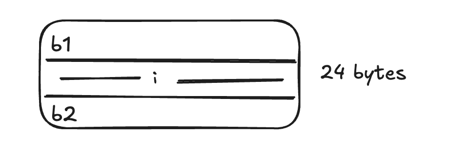
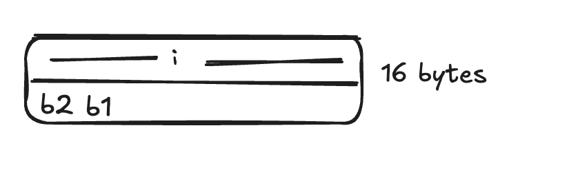

# go-scripts

Based on the book "100 mistakes of go and how to avoid them"
The online version has some things - https://100go.co/89-benchmarks/
Copied code to run benchmarks from above

To run benchmarks
`
go test -bench=. -benchmem
`

Output Example

BenchmarkMyFunction-8     2000000    1200 ns/op   256 B/op    4 allocs/op
BenchmarkOtherFunction-8   500000    2400 ns/op   512 B/op    8 allocs/op

2000000: Number of iterations of the benchmark.
1200 ns/op: Average time per operation in nanoseconds.
256 B/op: Average bytes allocated per operation.
4 allocs/op: Average number of allocations per operation.

### Map

1. When we insert new elements to a map, it has some constant factor or capacity which needs to be doubled when map size reaches a limit. This is O(n) since bucketing is done again. If we know map is gonna be large initialise it to save time. 

```
go test 100-go-mistakes/03-data-types/27-map-init/main_test.go -bench=. -benchmem
```

2. Maps always grow in size. Even if we delete elements, maps have properties such as bucket_ids which dont delete. Thus, if we add 1million elements to map and then delete them, the map will still hold lot of memory instead of 0.

```
go test 100-go-mistakes/03-data-types/27-map-init/main_test.go -bench=. -benchmem
```


### Optimizations

1. Cache hit - Slice of structs vs struct of slices (this is more efficient)

```
type Foo struct {
	a int64
	b int64
} --> []Foo

Stored as ababababbababa

type Bar struct {
	a []int64
	b []int64
}

Stored as aaaaaaaabbbbbbbb
```

Better spatial locality

```
go test -bench=. -benchmem ./100-go-mistakes/12-optimizations/91-cpu-caches/slice-structs/
```

2. Concurrent code - false sharing - https://100go.co/92-false-sharing/

- cache lines are replicated
- CPU is to guarantee cache coherency
- When a cache line is shared across multiple cores and at least one goroutine is a writer, the entire cache line is invalidated

Solution

- Padding
    - Because an int64 requires an 8-byte allocation and a cache line 64 bytes long, we need 64 – 8 = 56 bytes of padding
- Sharing through Channels

```
go test -bench=. -benchmem ./100-go-mistakes/12-optimizations/92-false-sharing/
```

3. instruction_parallelism_optimization

In this experiment, function 2 was supposed to be faster than function 1 but according to the benchmarks - sometimes it isnt

```
go test -bench=. -benchmem ./100-go-mistakes/12-optimizations/93-instruction-level-parallelism
```


4. Data alignment - 

- Way to arrange how data is allocated to speed up memory access
- “[…] a variable’s memory address should be a multiple of its own size”: this is the principle of data alignment.
- a struct's size is usually a multiple of the size of its largest field

```
type Foo1 struct {
	b1 byte \\ 1 byte
	i  int64 \\ 8 bytes
	b2 byte \\ 1 byte
} --->

type Foo1 struct {
	b1 byte \\ 1 byte
    _ [7] byte \\ Added by compiler
	i  int64 \\ 8 bytes
	b2 byte \\ 1 byte
    _ [7] byte \\ Added by compiler
}
```

This will be stored like




```
type Foo2 struct {
	i  int64
	b1 byte
	b2 byte 
}
```


```
go test -bench=. -benchmem ./100-go-mistakes/12-optimizations/94-data-alignment

2nd is faster since cache line is effective
```

rule of thumb - reorganize a struct so that its fields are sorted by type size in descending order


### Misc

1. If our application faces requests peaks which implies increase in heap memory, we should tweak garbage collector. Default is 100% ( Run GC when memory allocated increases by 100%)


### Microbenchmarks

`
go test -bench=. -count=10 | tee stats.txt
benchstat stats.txt
`

