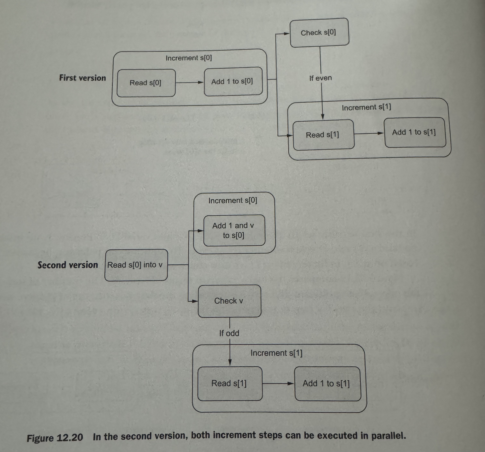

# go-scripts

Based on the book "100 mistakes of go and how to avoid them"
The online version has some things - https://100go.co/89-benchmarks/
Copied code to run benchmarks from above

To run benchmarks
`
go test -bench=. -benchmem
`

Output Example

BenchmarkMyFunction-8     2000000    1200 ns/op   256 B/op    4 allocs/op
BenchmarkOtherFunction-8   500000    2400 ns/op   512 B/op    8 allocs/op

2000000: Number of iterations of the benchmark.
1200 ns/op: Average time per operation in nanoseconds.
256 B/op: Average bytes allocated per operation.
4 allocs/op: Average number of allocations per operation.

### Map

1. When we insert new elements to a map, it has some constant factor or capacity which needs to be doubled when map size reaches a limit. This is O(n) since bucketing is done again. If we know map is gonna be large initialise it to save time. 

```
go test 100-go-mistakes/03-data-types/27-map-init/main_test.go -bench=. -benchmem
```


### Microbenchmarks

`
go test -bench=. -count=10 | tee stats.txt
benchstat stats.txt
`

## instruction_parallelism_optimization.go

In this experiment, function 2 was supposed to be faster than function 1 but according to the benchmarks - sometimes it isnt


